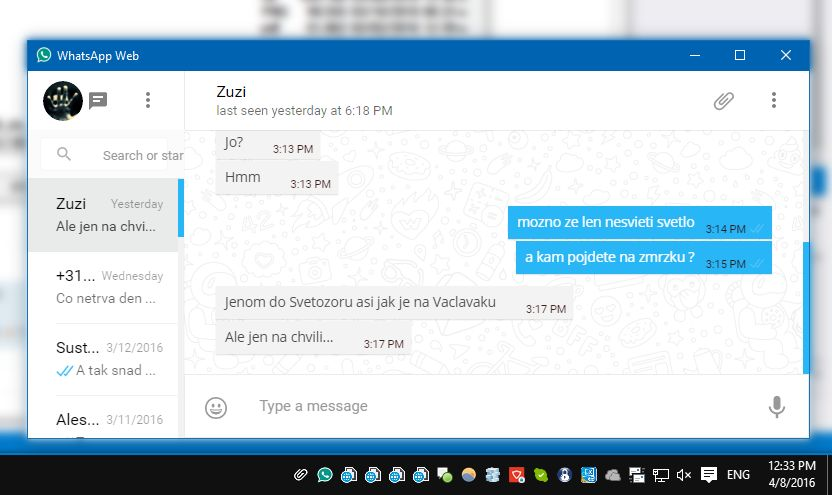

# &nbsp;WhatsApp-Desktop-Unofficial

> Unofficial WhatsApp app<br>
> Heavily inspired and adapted from [WhatsApp-Desktop-Unofficial](https://github.com/mawie81/WhatsApp-Desktop-Unofficial) by [Marcel Wiehle](https://github.com/mawie81).



*<strong>Note:</strong> In order to use this app a WhatsApp Web compatible device is required.*

<br>
## Features

 - Custom clean theme
 - Minimaze in tray
 - Notifications
 - Click on tray icon shows/hides app
 - Ctrl+w hides window
 - Alt - shows menu 


*Requires OS X 10.8+, Linux or Windows.*

<br>
## Install


### Linux

[**Download**](https://github.com/JanBN/WhatsApp-Desktop-Unofficial/releases/latest) and unzip to some location.

To add a shortcut to the app, create a file in `~/.local/share/applications` called `WhatsApp-Desktop-Unofficial.desktop` with the following contents:

```
[Desktop Entry]
Name=WhatsApp-Desktop-Unofficial
Exec=/full/path/to/folder/WhatsApp-Desktop-Unofficial
Terminal=false
Type=Application
Icon=/full/path/to/folder/WhatsApp-Desktop-Unofficial/resources/app/media/icon.png
```

### Windows

[**Download**](https://github.com/JanBN/WhatsApp-Desktop-Unofficial/releases/tag/1.0.0) and unzip to some location.<br>
Run WhatsApp-Desktop-Unofficial.exe

<br>
## License

MIT © [Jan Pivarcek](http://blowingnose.com)
